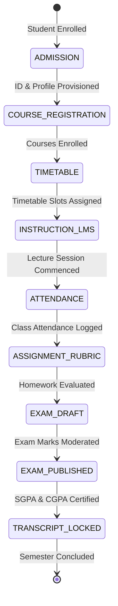

# CLASSROOM ERP — END-TO-END ACADEMIC LIFECYCLE WORKFLOW SPECIFICATION

## 1. Overview & Architectural Principles

The **Academic Lifecycle Architecture** of Classroom ERP is designed as a zero-trust, auditable, and state-machine-driven Academic Operating System. Every academic phase is bound to database constraints, role-based access control (RBAC), and FERPA-compliant privacy isolation.

```
┌─────────────────────────────────────────────────────────────────────────────────────────────────┐
│                                    ACADEMIC LIFECYCLE PIPELINE                                   │
├───────────────┬────────────────┬────────────────┬────────────────┬───────────────┬──────────────┤
│ 1. ADMISSION  │ 2. COURSE      │ 3. TIMETABLE & │ 4. ATTENDANCE  │ 5. CONTINUOUS │ 6. EXAMS &   │
│ & ENROLLMENT  │ REGISTRATION   │ SCHEDULING     │ & SESSIONS     │ ASSESSMENT    │ TRANSCRIPTS  │
│ - Identity    │ - Curricula    │ - Conflict Det │ - QR / BLE/GPS │ - Assignments │ - Grade Lock │
│ - Dossier     │ - Pre-reqs     │ - Faculty Map  │ - Anti-Proxy   │ - Rubrics     │ - GPA Engine │
└───────────────┴────────────────┴────────────────┴────────────────┴───────────────┴──────────────┘
```

---

## 2. Phase-by-Phase Academic Lifecycle

### Phase 1: Scholar Onboarding & Admission
1. **User Identity Provisioning**:
   - Super Admin or Institution Admin registers students via `POST /api/students` or bulk CSV upload.
   - Credentials generated using standard Email/Gmail + PBKDF2-derived password hashes (100,000 iterations, 64-byte salt).
   - System assigns unique `rollNumber` and `admissionNumber`.
2. **Document Archival & Dossier**:
   - Student or Registrar uploads identity documents (`ID_PROOF`, `PREVIOUS_TRANSCRIPT`) via `POST /api/documents`.
   - Files are stored with secure SHA-256 naming; access is strictly scoped so other students cannot inspect personal files.
3. **Tuition Billing Allocation**:
   - Registrar or Finance Officer assigns fee structure (`POST /api/finance`).
   - Academic faculty are strictly barred from querying or modifying student financial balances (FERPA compliance).

---

### Phase 2: Curriculum Structure & Course Registration
1. **Curriculum Design & Syllabi**:
   - Head of Department (HOD) and Faculty structure course modules via `POST /api/lms` (`action: "CREATE_MODULE"`).
   - Accredited Course Outcomes (COs) and learning objectives are anchored to each unit.
   - Faculty attach digital slide decks, lecture videos, and reading materials (`action: "ADD_MATERIAL"`).
2. **Student Course Enrollment**:
   - Students register for semester courses via `POST /api/courses/enroll`.
   - Enrollment status transitions: `PENDING` -> `ENROLLED` -> `COMPLETED`.
   - Faculty rosters dynamically populate based on enrolled scholars (`GET /api/faculty/classes`).

---

### Phase 3: Timetable Scheduling & Conflict Detection
1. **Slot Allocation**:
   - Academic scheduling office builds weekly slots (`POST /api/timetable`).
2. **Zero-Conflict Engine**:
   - The timetable engine (`src/lib/timetable/conflict-detector.ts`) automatically validates:
     - **Faculty Conflict**: An instructor cannot teach two classes simultaneously.
     - **Room Conflict**: A lecture hall or laboratory cannot host two sections at once.
     - **Section Conflict**: A student cohort cannot have overlapping class periods.

---

### Phase 4: Dynamic Attendance & Anti-Proxy Verification
1. **Session Initialization**:
   - Faculty launches attendance session for course & section (`POST /api/attendance`).
   - Modes: `MANUAL`, `SMART_COMBO`, `QR_ONLY`, `BLE_ONLY`, `GEOFENCE_ONLY`.
2. **Student Self-Verification**:
   - **Dynamic QR Code**: Projector displays rotating HMAC-SHA256 token that refreshes every 15 seconds (`APX_ATT_V2`).
   - **Geofence Boundary**: Device coordinates validated against classroom GPS perimeter using Haversine calculation (`<= 75m`).
   - **Bluetooth Proximity**: Web Bluetooth scans classroom BLE beacon RSSI to guarantee physical presence.
3. **Anti-Proxy Ledger**:
   - Unique database constraint on `[sessionId, studentId]` prevents duplicate logging.
   - Real-time audit logs record verification telemetry.

---

### Phase 5: Continuous Internal Evaluation (CIE)
1. **Assignment Desk**:
   - Faculty posts assignments with due dates, maximum points, and digital grading rubrics.
2. **Student Submission Desk**:
   - Students submit homework code or PDFs (`POST /api/assignments/submit`).
   - Built-in Jaccard similarity scanner flags potential plagiarism.
3. **Digital Rubric Evaluation & Grade Lock**:
   - Faculty evaluate submissions (`POST /api/assignments/grade`), applying weighted rubric criteria.
   - Faculty can apply `[LOCKED]` finalization flag. Once locked, grades cannot be overwritten without departmental HOD or administrative elevation.

---

### Phase 6: Examinations, GPA Calculation & Transcripts
1. **Exam Administration**:
   - Exam controller schedules mid-terms and finals (`POST /api/examinations`).
2. **Marks Entry (Draft vs Published)**:
   - Faculty submit raw marks in `DRAFT` status (`PUT /api/examinations`).
   - Draft marks are hidden from student transcripts to allow department moderation.
3. **Official Certification & Publication**:
   - Exam Controller certifies results (`status: "PUBLISHED"`).
   - Automated GPA engine calculates Semester GPA (SGPA) and Cumulative GPA (CGPA) according to credit weighting.
   - Students can view only their own certified report cards (`GET /api/examinations?studentId=...`).

---

### Phase 7: Academic Petitions & Attendance Rectification
1. **Student Petition Submission**:
   - Students submit petitions for medical leave or attendance discrepancies (`POST /api/students/requests`).
2. **Faculty / Admin Review**:
   - Faculty or Admin reviews the evidence (`PATCH /api/students/requests`).
3. **Ledger Rectification Execution**:
   - When approved, the system updates the student's `AttendanceRecord` to `EXCUSED` or `PRESENT`, appending audit notes with the request reference ID.
   - An immutable `AuditLog` entry (`ATTENDANCE_CHANGED`) is created.

---

## 3. Workflow State Transition Diagram


