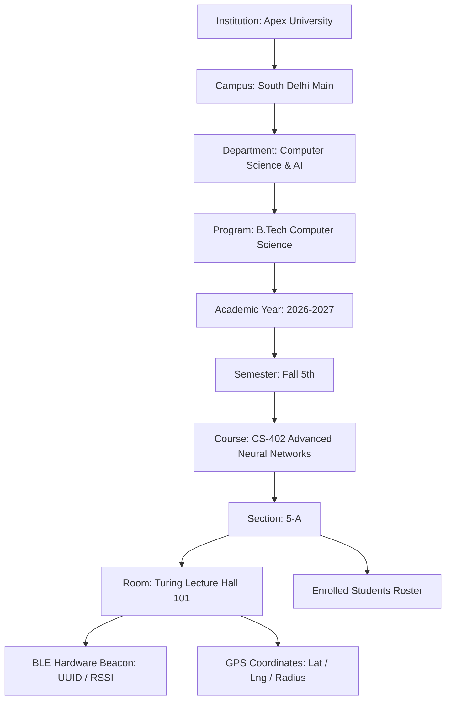
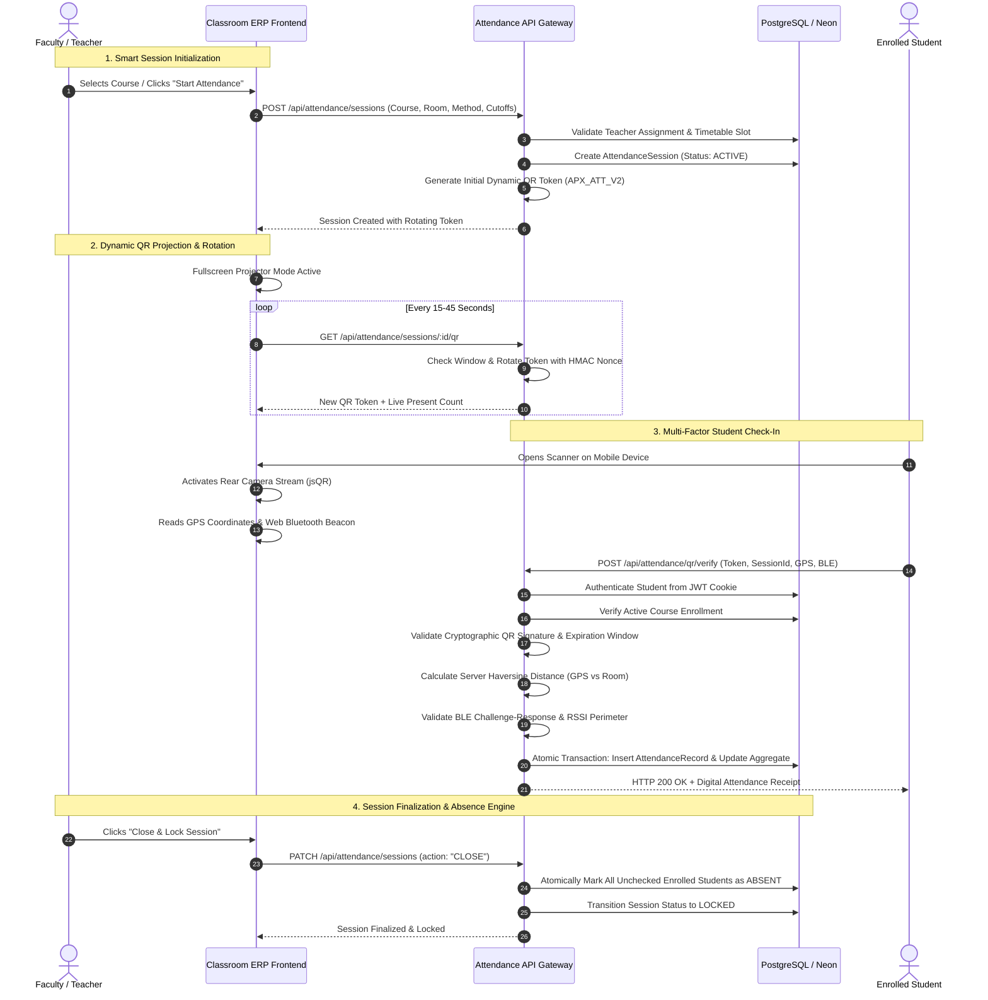

# CLASSROOM ERP — ATTENDANCE OPERATING SYSTEM ARCHITECTURE
## Multi-Factor Dynamic Verification, Telemetry & Decision Engine Specification

---

### 1. Academic Hierarchy & Attendance Domain Topology

---

### 2. Multi-Factor Verification & Decision Flow Pipeline

---

### 3. Verification Modes & Governance Policy

| Mode | Required Multi-Factor Checkpoints | Use Case | Security Level |
|---|---|---|---|
| **`MANUAL`** | Faculty direct roster check-in | Small lab groups, outdoor practicum | Standard |
| **`QR`** | Authenticated session + Dynamic Rotating QR | General university lectures | High |
| **`QR_GEOFENCE`** | Dynamic QR + Server-side Haversine Distance Verification | Large lecture halls, auditorium classes | Very High |
| **`QR_BLE`** | Dynamic QR + Web Bluetooth Beacon Challenge Proof | High-security exam halls, specialized computing labs | Extremely High |
| **`SMART_COMBO`** | Dynamic QR + GPS Geofence (<100m) + BLE Beacon RSSI | Enterprise campus defense against proxy and spoofing | Maximum Military Grade |

---

### 4. Data Models & Entity Relationships

- **`AttendanceSession`**:
  - `id`: UUID Primary Key
  - `courseId`, `facultyId`, `sectionId`, `roomId`
  - `date`: Session calendar date
  - `startTime`, `endTime`: Scheduled instruction window
  - `method`: `MANUAL` \| `QR` \| `SMART_COMBO`
  - `status`: `DRAFT` \| `ACTIVE` \| `PAUSED` \| `SUBMITTED` \| `LOCKED` \| `CLOSED`
  - `qrCodeToken`, `qrNonce`, `qrExpiresAt`, `qrRotationSeconds`
  - `latitude`, `longitude`, `allowedRadiusMeters`
  - `bleDeviceId`, `bleBeaconId`, `bleRequired`, `geofenceRequired`
  - `closedAt`, `createdAt`, `updatedAt`

- **`AttendanceRecord`**:
  - `id`: UUID Primary Key
  - `sessionId`: Foreign Key to `AttendanceSession` (Cascade Delete)
  - `studentId`: Foreign Key to `Student` (Cascade Delete)
  - `status`: `PRESENT` \| `ABSENT` \| `LATE` \| `EXCUSED`
  - `verificationMethod`: `MANUAL` \| `QR` \| `BLUETOOTH` \| `GEOFENCE` \| `COMBO`
  - `qrVerified`, `bluetoothVerified`, `geofenceVerified`: Booleans
  - `distanceMeters`: Server-calculated proximity (GPS)
  - `markedBy`: `STUDENT_SELF_SCAN` \| `FACULTY_MANUAL` \| `SYSTEM_ABSENCE_ENGINE`
  - `timestamp`: Verified timestamp
  - **Constraint**: `@@unique([sessionId, studentId])` (Prevents duplicate check-ins)

- **`BleDevice`**:
  - `id`: UUID Primary Key
  - `roomId`: Foreign Key to `Room`
  - `name`: Hardware identifier (e.g. `Turing-Hall-Beacon-01`)
  - `serviceUuid`, `characteristicUuid`, `beaconIdentifier`
  - `rssiThreshold`: Default -80 dBm
  - `isActive`: Boolean

---

### 5. Absence & Late Arrival Rules
1. **Late Threshold**:
   - A configurable window (default: 10 minutes from session start).
   - Check-ins received within `0` to `thresholdMins` are marked **`PRESENT`**.
   - Check-ins received after `thresholdMins` but before session closure are marked **`LATE`**.
2. **System Absence Engine**:
   - When faculty transitions the session to `CLOSED`, any student enrolled in the course section who has no corresponding `AttendanceRecord` is automatically created as **`ABSENT`**.
3. **Excused Status**:
   - Students with approved `ATTENDANCE_CORRECTION` petitions or verified medical leaves are recorded as **`EXCUSED`**, contributing to numerator attendance credit under university Senate regulations.
