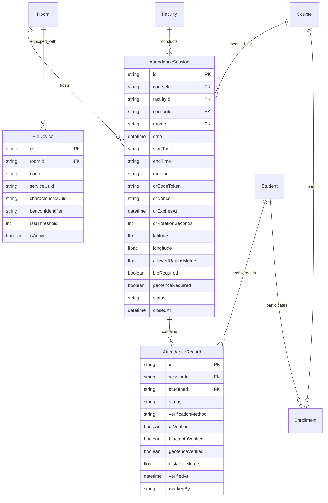

# CLASSROOM ERP — SMART ATTENDANCE ARCHITECTURE
## Dynamic Rotating QR + Web Bluetooth Proximity + Server-Side Geofence + Anti-Proxy

**System:** CLASSROOM — Academic OS / Higher Education ERP  
**Version:** 2.4-Production  
**Author:** Principal Education ERP Architect & Security Systems Engineer  
**Date:** September 2026  

---

## 1. System Overview & Problem Statement

Traditional academic attendance tracking suffers from rampant proxy marking, including:
1. **Physical Proxy:** Students swiping cards for absent peers.
2. **Screenshot Forwarding:** Present students taking photos of static QR codes and messaging them to absent peers.
3. **Off-Campus Spoofing:** Students scanning from dormitories or outside lecture halls.
4. **Un-enrolled Submissions:** Students logging in and marking courses they are not officially enrolled in.

The **CLASSROOM Smart Attendance Engine** eliminates these vulnerabilities by combining four cryptographically bound factors:
1. **Dynamic HMAC-SHA256 Signed Rotating QR Tokens** (15-second sliding lifecycle).
2. **Web Bluetooth Low Energy (BLE) Proximity Verification** with GATT challenge-response.
3. **Server-Side Great-Circle Geofencing** using the Haversine formula against registered classroom coordinates.
4. **Enforced RBAC & Course Enrollment Verification** within an atomic database transaction.

---

## 2. Cryptographic Rotating QR Specification

### 2.1 Token Format
Tokens generated by the server follow a 6-part dot-delimited structure:
```
APX_ATT_V2.<sessionId>.<nonce>.<issuedAt>.<expiresAt>.<signature>
```

| Component | Format | Description |
| :--- | :--- | :--- |
| `prefix` | `APX_ATT_V2` | Constant protocol version identifier. |
| `sessionId` | UUIDv4 | Unique identifier of the `AttendanceSession`. |
| `nonce` | 16-hex characters | Cryptographically secure random bytes (`crypto.randomBytes(8)`). |
| `issuedAt` | Unix epoch (seconds) | Server generation timestamp. |
| `expiresAt` | Unix epoch (seconds) | Expiration timestamp (`issuedAt + rotationSeconds`). |
| `signature` | 32-hex characters | 128-bit truncated HMAC-SHA256 signature. |

### 2.2 HMAC Signing & Verification
The data payload is signed using the server's master secret (`JWT_SECRET`):
$$\text{DataToSign} = \text{"APX\_ATT\_V2:"} + \text{sessionId} + \text{":"} + \text{nonce} + \text{":"} + \text{issuedAt} + \text{":"} + \text{expiresAt}$$
$$\text{Signature} = \text{HMAC-SHA256}(\text{DataToSign}, K_{\text{server}})[0 \dots 31]$$

### 2.3 Clock Skew & Sliding Window Tolerance
* The client refreshes the displayed QR code every 15 seconds.
* To account for network transit latency, mobile cellular delays, and slight NTP clock variance, the server allows a **$\pm 5$ second clock tolerance window**:
  $$\text{Valid if: } \quad (\text{issuedAt} - 5) \le \text{currentTime} \le (\text{expiresAt} + 5)$$
* Any token submitted after `expiresAt + 5s` is immediately rejected with an actionable message prompting the student to scan the latest code on the screen.

---

## 3. Web Bluetooth Low Energy (BLE) Proximity Architecture

```
+-----------------------------------------------------------+
|               Classroom BLE Hardware Beacon               |
|      (ESP32 / Raspberry Pi / Institutional Beacon Dongle)  |
|                                                           |
|  * Service UUID: 0000ffe0-0000-1000-8000-00805f9b34fb     |
|  * Characteristic: Challenge-Response (0000ffe1)          |
|  * Calibrated RSSI: -60 dBm at 1 meter                    |
+-----------------------------------------------------------+
                             ▲
                             │ BLE Advertising & GATT Connect
                             ▼
+-----------------------------------------------------------+
|                 Student Mobile Browser                     |
|           (Chrome on Android / Edge on Laptop)            |
|                                                           |
|  * Detects navigator.bluetooth capability                 |
|  * Requests GATT pairing to classroom beacon service      |
|  * Obtains dynamic proximity proof                        |
+-----------------------------------------------------------+
```

### 3.1 Browser Matrix & Fallback Architecture
Web Bluetooth (`navigator.bluetooth`) is supported in Chromium-based browsers (Chrome, Edge) on Android, Windows, macOS, and Chrome OS, but is currently not supported natively in Apple Safari or Mozilla Firefox.

To ensure **100% student accessibility without locking out iOS users**, the system implements a resilient fallback hierarchy:
* **Mode A: SMART_COMBO (Recommended)**
  * Android / Chrome: Full Multi-Factor (Dynamic QR + BLE Proximity + GPS Geofence).
  * iOS / Safari: Automatic graceful degradation (Dynamic QR + GPS Geofence). The system flags the verification method as `GEOFENCE` instead of `COMBO` while still preventing remote screenshot proxying.
* **Mode B: BLE_REQUIRED**
  * Strictly requires BLE beacon pairing. Configurable per session for high-security proctored examinations or restricted laboratories.

---

## 4. Server-Side Geofencing Verification

The client captures GPS coordinates using `navigator.geolocation.getCurrentPosition({ enableHighAccuracy: true })` and transmits `(latitude, longitude, accuracy)` to the server. The client **never** computes whether it is "inside" the geofence to prevent client-side inspection or tampering.

### 4.1 Great-Circle Distance Calculation (Haversine Formula)
$$\Delta \varphi = \frac{\pi}{180} (\text{lat}_2 - \text{lat}_1), \quad \Delta \lambda = \frac{\pi}{180} (\text{lon}_2 - \text{lon}_1)$$
$$a = \sin^2\left(\frac{\Delta \varphi}{2}\right) + \cos\left(\frac{\pi}{180} \text{lat}_1\right) \cos\left(\frac{\pi}{180} \text{lat}_2\right) \sin^2\left(\frac{\Delta \lambda}{2}\right)$$
$$c = 2 \cdot \text{atan2}\left(\sqrt{a}, \sqrt{1 - a}\right)$$
$$d = R_{\text{earth}} \cdot c \quad (R_{\text{earth}} = 6,371,000 \text{ meters})$$

### 4.2 Distance Threshold & GPS Accuracy Buffer
The verification passes if:
$$d \le \text{allowedRadiusMeters} + \min(\text{accuracy}, 25\text{m})$$
Default `allowedRadiusMeters` is 100 meters, which comfortably encompasses lecture halls while firmly rejecting remote check-ins from off-campus locations.

---

## 5. End-to-End Verification Pipeline

```
[Student Device]
       │
       ▼
1. Scan Dynamic QR Code via Environment Camera (BarcodeDetector / jsQR)
2. Capture GPS Coordinates (navigator.geolocation)
3. (Optional) Handshake Classroom BLE Beacon (navigator.bluetooth)
4. POST /api/attendance/qr/verify
       │
       ▼
[Server: POST /api/attendance/qr/verify]
       │
       ├─► 1. Check User Auth & Student Record Linkage (Anti-Account Hijack)
       ├─► 2. Verify HMAC-SHA256 Token Signature (Anti-Forgery)
       ├─► 3. Verify Server Expiration Window [now <= expiresAt + 5s] (Anti-Replay)
       ├─► 4. Verify AttendanceSession State is ACTIVE (Anti-Expired Session)
       ├─► 5. Verify Student Course Enrollment in DB (Anti-Unauthorized Check-in)
       ├─► 6. Compute Haversine Distance <= allowedRadius (Anti-Remote Proxy)
       ├─► 7. Verify BLE Challenge Token (if BLE Required/Enabled)
       ├─► 8. Check Unique Constraint [sessionId, studentId] (Anti-Duplicate)
       └─► 9. Atomic Transaction:
               - Write AttendanceRecord (PRESENT, verificationMethod, audit data)
               - Record device fingerprint & verified timestamp
               - Trigger real-time attendance metric increment
```

---

## 6. Database ERD & Schema Extensions



---

## 7. Role-Based Access Control (RBAC) Matrix

| Operation | Super Admin | Institution Admin | Faculty / Professor | Student |
| :--- | :---: | :---: | :---: | :---: |
| **Launch Attendance Session** | Yes | Yes | Yes (Assigned Courses) | No |
| **Open Projector Mode** | Yes | Yes | Yes (Assigned Courses) | No |
| **Pause / Resume / Close Session** | Yes | Yes | Yes (Session Owner) | No |
| **Register Classroom BLE Devices** | Yes | Yes | No | No |
| **Scan Dynamic QR Code** | Test Mode | Test Mode | Test Mode | Yes (Enrolled Courses) |
| **View Personal Attendance History**| Yes | Yes | Yes | Yes (Self Only) |
| **Submit Attendance Correction** | No | No | No | Yes |
| **Manual Roster Override** | Yes | Yes | Yes (Assigned Courses) | No |
