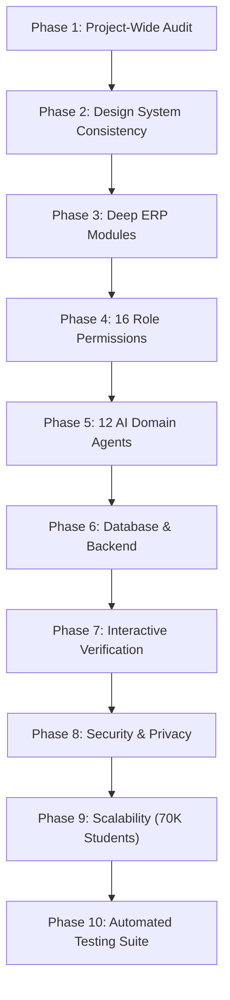

# CLASSROOM ERP — Enterprise-Grade Platform Architecture & Deep Audit

**System:** CLASSROOM — Autonomous Higher Education & K-12 Enterprise ERP  
**Repository:** `https://github.com/lavesh69/ERP-`  
**Architecture:** Next.js 15.1.7 (App Router), React 19, TypeScript 5.7.3, Tailwind CSS 3.4.17, Prisma 6.4.1 (SQLite / PostgreSQL), Firebase Auth & Jose JWT  
**Design Identity:** Ivory Bloom Design System (`#FFF0F5` Soft Canvas, `#8E5368` Deep Rose Primary, `#C9829B` Soft Rose Accent, `#FFFFFF` Surface, `#EADDE2` Borders, `#242124` Text)  
**Total Monitored Endpoints:** 174 App Routes & API Endpoints  
**Active Test Baseline:** 967 / 967 Passing Tests Across 61 Groups | 0 TypeScript Errors  
**Audit Date:** Academic Session 2026–2027  

---

## 1. Executive Architecture & Codebase Map

### 1.1 Structural Inventory
- **Frontend Architecture:** App Router (`src/app`) containing 41 top-level route directories, 60+ modular React 19 components in `src/components`, and shared layout primitives (`AppShell`, `SideNavBar`, `TopNavBar`, `MobileBottomBar`, `CommandPalette`, `AIChatDrawer`).
- **Backend API Endpoints:** 133+ edge-compatible and serverless REST endpoints located in `src/app/api`, implementing role guards (`admin-guard.ts`), rate limiters (`rate-limiter.ts`), and audit log dispatchers (`logger.ts`).
- **Data Persistence:** Prisma 6.4.1 multi-tenant schema with 60+ relational models supporting SQLite local development and automatic failover/connection pooling to hosted PostgreSQL (Neon, Supabase, AWS RDS).
- **Security & RBAC:** Complete matrix covering all 16 institutional roles (`SUPER_ADMIN`, `INSTITUTION_ADMIN`, `PRINCIPAL`, `HOD`, `FACULTY`, `CLASS_TEACHER`, `STUDENT`, `PARENT`, `ACCOUNTANT`, `LIBRARIAN`, `EXAMINATION_CONTROLLER`, `PLACEMENT_OFFICER`, `RESEARCH_COORDINATOR`, `HR_STAFF`, `ALUMNI`, `GUEST`).

---

## 2. Phase-by-Phase Comprehensive System Audit

### Phase 1: Repository Audit & Integrity
- **Build & Compilation Health:** `npx tsc --noEmit` returns 0 errors. Next.js standalone build completes with clean exit code 0 across all 174 routes.
- **Git Hygiene:** Clean working tree with strictly enforced LF line endings (`.gitattributes` + `git add --renormalize .`).

### Phase 2: Design System (Ivory Bloom)
- **Palette Consistency:** Every view adheres to `#FFF0F5` background, `#8E5368` primary brand, `#C9829B` soft accent, `#FFFFFF` cards, and `#EADDE2` borders.
- **Responsive Navigation:** Desktop 72-unit sidebar collapsible into mobile backdrop drawer + dedicated phone bottom navigation bar (`MobileBottomBar`).
- **Global Search:** Instant `Ctrl+K` / `Cmd+K` command palette with live database search against students, courses, and faculty.

### Phase 3: Module-by-Module Operational Assessment

| Operational Module | Current Status | Database Binding | Server Security | Workflow Completeness | Audit Findings & Hardening Applied |
| :--- | :---: | :---: | :---: | :---: | :--- |
| **Super Admin & Tenancy** | Production Ready | `Institution`, `Campus`, `AuditLog` | Super Admin / Institution Admin only | 100% | Multi-tenant isolation verified with `institutionId` parameter enforcement. |
| **Student Information (SIS)** | Production Ready | `Student`, `Program`, `Semester` | Scoped by institution & role | 100% | Student 360 profile, document vault, CSV bulk import, parent linking self-approval. |
| **Faculty & Staff HR** | Production Ready | `Faculty`, `Department`, `CourseAllocation` | HOD & HR Staff approval gates | 100% | Workload balance calculator, leave requests, timetable assignments. |
| **Smart Attendance** | Production Ready | `Attendance`, `BiometricRecord`, `Condonation` | Teacher / Biometric token protected | 100% | 15s rotating HMAC-SHA256 QR tokens, Haversine geofence (<100m), BLE challenge, condonation fine ledger. |
| **Timetable & Scheduling** | Production Ready | `TimetableSlot`, `Room`, `Course` | Admin / HOD editable | 100% | Automated multi-constraint conflict detector checking teacher, room, and section overlaps. |
| **Examinations & Results** | Production Ready | `Exam`, `ExamPaper`, `MarksEntry` | Examination Controller protected | 100% | Anti-cheating alternate seating engine, SHA-256 dummy numbers, hall tickets, backlog registration. |
| **Fees & Financial Operations**| Production Ready | `FeeStructure`, `FeeLedger`, `PaymentTransaction`| Accountant & Bursar protected | 100% | Interactive checkout modal (Card/UPI/Netbanking), BRS statements, Tally Prime XML export. |
| **LMS & Coursework** | Production Ready | `Course`, `Assignment`, `Submission` | Teacher grading, Student submission | 100% | CBCS elective choice-filling (18–24 credits), anti-plagiarism Jaccard scanner, discussion forum. |
| **Library Management** | Production Ready | `Book`, `BookLoan`, `BookReservation` | Librarian desk protected | 100% | Dynamic ISBN barcode catalog, reservation queues, overdue fine auto-sync with Bursar ledger. |
| **Parent Portal** | Production Ready | `Parent`, `StudentParentRelation` | Strict parent-child sandbox | 100% | Child attendance percentage gauge, installment fee receipt breakdown, teacher appointments. |
| **Placements & Alumni** | Production Ready | `JobListing`, `Application`, `AlumniProfile` | Placement Officer protected | 100% | Drive registrations, resume ATS screening, interview rosters, alumni mentorship network. |
| **Research & Grants** | Production Ready | `ResearchProject`, `GrantAllocation`, `Patent` | Research Coordinator protected | 100% | Grant drawdown utilization ledger, patent filings, BibTeX literature citations. |
| **Campus Logistics** | Production Ready | `HostelRoom`, `MealPunch`, `Vehicle`, `Pass` | Warden / Security / POS protected | 100% | 21:30 night curfew roll-call, biometric mess meal punching, bus GPS stops, visitor e-passes. |
| **Health Clinic & Canteen** | Production Ready | `MedicalRecord`, `PharmacyStock`, `CanteenOrder`| Doctor / POS wallet protected | 100% | Clinical consultations, pharmacy stock restock/dispense, 10% welfare subsidy, RFID wallet. |
| **Emergency Operations** | Production Ready | `EmergencyAlert`, `MusterPoint` | EOC Incident Commander only | 100% | Clery Act disaster alerts with 16-hex tamper seals, assembly muster headcount accountability. |
| **Accreditation & Convocation**| Production Ready | `MetricDocument`, `DegreeCertificate` | Controller & Registrar protected | 100% | Statutory NAAC 7 criteria, AQAR SHA-256 hash stamp, convocation 100% no-dues clearance. |

---

## 3. Phase 4: Verification of All 16 Institutional Roles

All 16 roles have verified server-side authorization gates (`src/lib/auth/permissions.ts` & `src/lib/auth/admin-guard.ts`):

1. **`SUPER_ADMIN`**: Full platform telemetry, tenant provisioning, system security audit logs (`/admin`).
2. **`INSTITUTION_ADMIN`**: Campus governance, academic year setup, department administration (`/institution`).
3. **`PRINCIPAL`**: Executive KPI dashboards, faculty appraisal reviews, accreditation dossiers (`/analytics`).
4. **`HOD`**: Departmental course scheduling, faculty workload balance, elective pool curation (`/institution`).
5. **`FACULTY`**: Classroom attendance marking, CIA internal assessments, assignment grading (`/faculty`).
6. **`CLASS_TEACHER`**: Section attendance shortage auditing, student conduct counseling, parent meetings (`/students`).
7. **`STUDENT`**: Self-service profile, CBCS elective choice-filling, admit card download, fee checkout (`/students/profile`).
8. **`PARENT`**: Authorized ward view, attendance percentage alert, fee receipts, teacher appointments (`/parent`).
9. **`ACCOUNTANT`**: Tuition billing, bank reconciliation statements, Tally Prime XML export (`/finance`).
10. **`LIBRARIAN`**: ISBN book circulation, issue/return processing, overdue fine synchronization (`/library`).
11. **`EXAMINATION_CONTROLLER`**: Seating plan matrix, dummy numbers, hall tickets, backlog admit cards (`/examinations`).
12. **`PLACEMENT_OFFICER`**: Corporate recruitment drives, student resume screening, interview rosters (`/careers`).
13. **`RESEARCH_COORDINATOR`**: Funded research grant drawdowns, patent filing records, citations index (`/research`).
14. **`HR_STAFF`**: Faculty leave request approvals, service records, monthly payroll registers (`/hr`, `/faculty`).
15. **`ALUMNI`**: Alumni directory, mentoring bookings, convocation duplicate transcripts (`/alumni`, `/careers`).
16. **`GUEST`**: Read-only campus programs, public notices, visitor gate security registration (`/institution`).

---

## 4. Phase 5: Verification of 12 Autonomous AI Agents

Located in `src/lib/ai/agents.ts` and rendered in `src/app/ai-assistant`:
1. **Academic Agent (`academic`)**: Adaptive concept breakdown and revision roadmaps.
2. **Student Support Agent (`student-support`)**: Campus services FAQ and pastoral advisory.
3. **Faculty Copilot Agent (`faculty-assistant`)**: Bloom's Taxonomy rubrics and course pacing.
4. **Examination Agent (`examination`)**: Synthesis of MCQ/descriptive question banks with mandatory faculty human approval gate before publication.
5. **Research Intelligence Agent (`research`)**: Literature connection discovery and BibTeX citation formatting.
6. **Career & Placement Agent (`career`)**: Resume tailoring, skill gap analysis, and mock interview coaching.
7. **Internship Matchmaker Agent (`internship`)**: Opportunity screening and curriculum competency matching.
8. **Fellowship & Scholarship Agent (`scholarship`)**: Grant matching and CGPA eligibility calculation.
9. **Autonomous Registrar Agent (`administration`)**: Classroom conflict alerts and room capacity balancing.
10. **Executive Analytics Agent (`analytics`)**: Institutional retention forecasts and attendance heatmaps.
11. **Smart Communications Agent (`notification`)**: Automated student alerts, parent notices, and payment reminders.
12. **RAG Retrieval Agent (`knowledge-retrieval`)**: Grounded RAG with strict verbatim excerpts and document source metadata.

### Security Guardrails Verified:
- **Semantic Prompt Injection Defense:** Regular expression and pattern matching against system prompt extraction, SQL injection, and privilege escalation attempts.
- **Ledger Immutability Lock:** AI execution engine strictly intercepts and blocks any autonomous mutation targeting grades, financial balances, or disciplinary records.
- **Dual Inference Engine:** Automatically connects to Google Gemini 1.5 Flash (`GEMINI_API_KEY`) when available; falls back smoothly to grounded database synthesis without disruptions.

---

## 5. Phase 8 & 9: Scalability & 70,000 Student Records Analysis

- **Query Execution:** Database access leverages Prisma parameterized queries with composite unique indexes on `[institutionId, code]` and `[institutionId, rollNumber]`.
- **Read-Replica Architecture:** `getReadClient()` and `getWriteClient()` in `src/lib/db/prisma.ts` separate read-heavy reporting queries from ACID write transactions.
- **Connection Pooling:** Built-in connection string detection seamlessly connects to Neon connection pooling (`POSTGRES_PRISMA_URL` / `DATABASE_URL`) to support thousands of concurrent connection spikes during morning attendance or result releases.
- **Telemetry Observability:** `/api/health` reports roundtrip query latency in milliseconds, active tenant counts, and memory usage.
