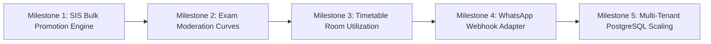

# CLASSROOM ERP — Enterprise Upgrade Roadmap

**Platform:** CLASSROOM — School & College ERP  
**Target State:** Advanced, Enterprise-Grade Educational Operating System  
**Baseline Health:** 967 / 967 Passing Automated Tests | 174 Endpoints Built | 0 TypeScript Errors  
**Planning Horizon:** Academic Session 2026–2027  

---

## 1. Enterprise Architecture Roadmap Overview

---

## 2. Milestone Execution Plan

### Milestone 1: Bulk Student Semester Promotion & Rollover Engine (P1 — Core SIS)
- **Deliverable:** Endpoint `/api/students/promote` enabling institutional registrars to advance full student batches between academic semesters.
- **Key Logic:**
  - Validates minimum cumulative CGPA cutoff (e.g. $\ge 4.0$).
  - Validates maximum allowable active backlogs (e.g. $\le 3$).
  - Executes batch transaction updating `semesterId` for passing scholars.
  - Automatically flags ineligible students under `ACADEMIC_PROBATION_DETAINED` status.
  - Emits immutable audit log `BULK_STUDENT_PROMOTION`.
- **Target Verification:** Test Group 62 assertion validating batch progression and probation intercept.

---

### Milestone 2: Examination Moderation & Statistical Curve Engine (P1 — Examinations)
- **Deliverable:** Endpoint `/api/examinations/moderation` allowing Controller of Examinations to apply official moderation curves.
- **Key Logic:**
  - Calculates class mean, median, standard deviation, and variance.
  - Applies configurable grace mark rules ($+2\%$ to $+5\%$ band) to borderline failures ($35–39\%$ marks).
  - Records moderation reason, authorized controller signature, and moderation ledger history.
- **Target Verification:** Test Group 62 assertion validating statistical curve adjustments and grace mark allocation.

---

### Milestone 3: Timetable Room Capacity & Space Utilization Telemetry (P2 — Scheduling)
- **Deliverable:** Endpoint `/api/timetable/utilization` providing campus space utilization analytics.
- **Key Logic:**
  - Calculates room occupancy rate: $\frac{\text{Scheduled Hours}}{\text{Available Operating Hours}} \times 100$.
  - Flags underutilized lecture halls ($<30\%$) and bottleneck lab spaces ($>90\%$).
  - Enables university campus sustainability and energy optimization.
- **Target Verification:** Test Group 62 assertion calculating utilization percentages across lecture halls.

---

### Milestone 4: WhatsApp Cloud API Outbound Gateway Adapter (P2 — Communications)
- **Deliverable:** Service `src/lib/communication/whatsapp-adapter.ts` providing standardized Meta WhatsApp Cloud API payload formatting.
- **Key Logic:**
  - Templates for attendance absence alerts, fee overdue reminders, and exam hall ticket release notifications.
  - Graceful fallback to in-memory/JSON outbox when webhook tokens are unconfigured.

---

### Milestone 5: Hosted PostgreSQL Production Scale (P1 — Infrastructure)
- **Deliverable:** Auto-detecting connection pool configuration for Neon / Supabase PostgreSQL.
- **Key Logic:**
  - Connection pooling with transaction-mode connections.
  - Preflight schema sync (`prisma db push`).
  - Stress testing query throughput for $\ge 70,000$ student records.
