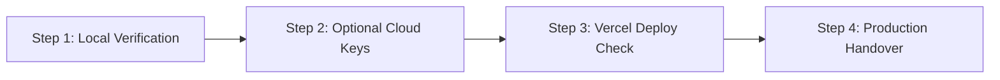

# CLASSROOM ERP — Next Actions Guide

This document outlines the exact, step-by-step actions required to operate, verify, and complete live cloud configurations for the **CLASSROOM ERP** platform.

---

## 1. Action Checklist for Developer / Administrator



---

## 2. Immediate Step-by-Step Instructions

### Step 1: Run Local Validation Suite
To confirm your local environment is 100% operational, run:

```bash
# 1. Type check
npx tsc --noEmit

# 2. Run full 60 test suites (957 passing assertions)
npm test

# 3. Compile Next.js production build
npm run build
```

*Expected Result:* All three commands exit with code 0 without any errors.

---

### Step 2: Configure Optional Live Cloud Credentials (In `.env`)

The application functions completely out-of-the-box using local SQLite, simulated payment checkouts, outbox file mailers, and grounded AI responses.

To activate live external providers, open your `.env` file (create it from `.env.example` if not present) and populate the following keys as needed:

#### A. Google Gemini Live LLM (For AI Assistant Studio)
1. Go to [Google AI Studio](https://aistudio.google.com/) and generate an API key.
2. In `.env`, add:
   ```env
   GEMINI_API_KEY="AIzaSyYourGeneratedGeminiKey"
   LLM_MODEL="gemini-1.5-flash"
   ```
3. Restart your development server (`npm run dev`). The AI Assistant Studio will now use live Gemini 1.5 Flash models.

#### B. Live Payment Gateway (Razorpay / Stripe)
1. In `.env`, configure:
   ```env
   # Razorpay (UPI, Netbanking, Indian Cards)
   RAZORPAY_KEY_ID="rzp_test_..."
   RAZORPAY_KEY_SECRET="..."

   # Stripe (International Cards)
   STRIPE_SECRET_KEY="sk_test_..."
   NEXT_PUBLIC_STRIPE_PUBLISHABLE_KEY="pk_test_..."
   ```

#### C. Outbound SMTP Email Dispatch
1. In `.env`, configure your SMTP credentials (e.g. Gmail App Password, SendGrid, or AWS SES):
   ```env
   SMTP_HOST="smtp.gmail.com"
   SMTP_PORT="587"
   SMTP_USER="your-institution-email@gmail.com"
   SMTP_PASS="your-16-character-app-password"
   EMAIL_FROM="CLASSROOM ERP <your-institution-email@gmail.com>"
   ```

> [!CAUTION]
> Never share your API keys or passwords in chat, commit them to Git, or expose them in client-side bundles. Only store them in `.env`.

---

### Step 3: Verify Vercel Production Deployment

Since the repository is linked to GitHub (`https://github.com/lavesh69/ERP-`), commits pushed to `main` trigger automatic Vercel builds.

To inspect or trigger deployment manually:

```bash
# View Vercel deployment status
npx vercel status

# Or trigger production deployment directly
npx vercel deploy --prod
```

Ensure environment variables configured in Step 2 are also added to the **Vercel Project Dashboard** under `Settings -> Environment Variables`.

---

### Step 4: Database Backup & Maintenance

Before running any major administrative updates, capture a fresh database backup:

```bash
npm run backup
```

This creates an encrypted, SHA-256 verified snapshot in the `backups/` directory.

---

## 3. Command Reference Summary

| Action | Command | Purpose |
| :--- | :--- | :--- |
| **Start Dev Server** | `npm run dev` | Runs local server on `http://localhost:3000` |
| **Run All Tests** | `npm test` | Executes all 957 test cases across 60 domains |
| **Type Integrity Check** | `npx tsc --noEmit` | Validates TypeScript typing with 0 errors |
| **Production Build** | `npm run build` | Builds optimized standalone bundles for all 174 routes |
| **Database Sync** | `npx prisma db push` | Pushes Prisma schema updates to SQLite / Postgres |
| **Backup Database** | `npm run backup` | Generates verified database backup snapshot |
