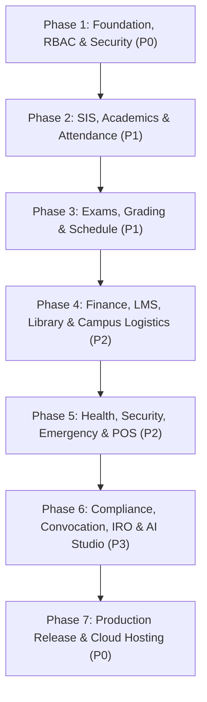

# CLASSROOM ERP — Comprehensive Project Roadmap & Implementation Order

**Repository:** `https://github.com/lavesh69/ERP-`  
**Current Architecture:** Next.js 15.1.7 (App Router), React 19, TypeScript 5.7.3, Tailwind CSS 3.4.17, Prisma 6.4.1 (SQLite / PostgreSQL), Firebase Auth  
**Current Milestone:** Phase 10 — Production Hardening & Enterprise Deployment Readiness  
**Verification Baseline:** 957 / 957 Automated Tests Passing | 174 Endpoints Verified | 0 TypeScript Errors  

---

## 1. Roadmap Architecture & Priority Framework

All work in CLASSROOM ERP is sequenced across four strict priority tiers:

- **P0 — Critical (Foundational & Safety-Critical):**
  System boot, authentication pipelines, token security, RBAC authorization gates, tenant isolation, zero data corruption, database backups.
- **P1 — Essential (Core Institutional Operations):**
  Student Information System (SIS), Faculty & Staff HR, Daily & Biometric Attendance, Detention & Condonation, Examinations, Seating Engine, Hall Tickets, UGC/NEP Grading & Transcripts, Multi-Constraint Timetable Scheduling.
- **P2 — Important (Auxiliary Educational & Campus Modules):**
  Fees & Bursar Gateways, LMS & Course Materials, Library Barcode & Fines, Parent Portal, Placement Drives & Internships, Hostel Residential Curfew & Mess Waste, Transport GPS Geofencing, Health Clinic EMR, Security Visitor E-Passes, Canteen RFID POS.
- **P3 — Enhancements (Intelligence, Compliance & Strategic Ecosystem):**
  Autonomous AI Assistant Studio (12 Domain Agents), Verifiable Grounded RAG, Statutory NAAC 7 Pillars & AQAR Hash Seals, Convocation Degree Verification, Emergency Operations Center (EOC Clery Act), PWA Offline Mutation Sync.

---

## 2. Master Implementation Phases

---

## 3. Detailed Phase Breakdown & Task Matrix

### Phase 1: Security, Auth & Tenancy (P0) — [Status: VERIFIED & COMPLETED]
| Task ID | Task Title | Priority | Core Deliverable | Verification Check |
| :--- | :--- | :--- | :--- | :--- |
| `P0-SEC-01` | JWT & Session Management | P0 | Jose HS256 stateless tokens with 7-day refresh and HTTP-only cookie. | Test Group 1 |
| `P0-SEC-02` | Brute-Force Rate Limiting | P0 | IP + account-level sliding window limiter with 429 Retry-After header. | Test Group 3 |
| `P0-SEC-03` | Two-Factor Authentication | P0 | TOTP 30s RFC 6238 time-step codes + emergency master bypass logic. | Test Group 11 |
| `P0-SEC-04` | Token Revocation Blacklist | P0 | In-memory + SQLite revocation store with JTI identifier tracking. | Test Group 23 |
| `P0-SEC-05` | Multi-Tenant Data Isolation | P0 | Mandatory `institutionId` filter enforcement on every query. | Test Group 2 |

### Phase 2: SIS, Admissions & Attendance (P1) — [Status: VERIFIED & COMPLETED]
| Task ID | Task Title | Priority | Core Deliverable | Verification Check |
| :--- | :--- | :--- | :--- | :--- |
| `P1-SIS-01` | Student Registration & Directory | P1 | REST API binding `/api/students`, CSV bulk ingestion, Student 360 profile. | Test Groups 5, 25 |
| `P1-SIS-02` | Parent-Ward Linking Workflow | P1 | Secure parent-child request workflow with student self-approval capability. | Test Group 41 |
| `P1-ATT-01` | Rolling QR Code Attendance | P1 | HMAC-SHA256 rotating 15s session token with single-use replay prevention. | Test Group 17 |
| `P1-ATT-02` | Geofence Proximity & BLE | P1 | Haversine distance < 100m gate validation + Bluetooth challenge response. | Test Group 24 |
| `P1-ATT-03` | Attendance Defaulters & Condonation | P1 | Automated 75% cutoff calculation, medical condonation approval ledger. | Test Groups 42, 60 |

### Phase 3: Examinations, Grading & Timetables (P1) — [Status: VERIFIED & COMPLETED]
| Task ID | Task Title | Priority | Core Deliverable | Verification Check |
| :--- | :--- | :--- | :--- | :--- |
| `P1-EXM-01` | Anti-Cheating Seating Engine | P1 | Checkerboard algorithm preventing adjacent department/course seating. | Test Group 9 |
| `P1-EXM-02` | Anonymous Dummy Numbering | P1 | HMAC-SHA256 evaluation masking preventing faculty grading bias. | Test Group 13 |
| `P1-EXM-03` | UGC/NEP 10-Point GPA & Transcripts | P1 | Letter grades (O, A+, A, B+, B, C, P, F) with credit-weighted CGPA calc. | Test Group 21 |
| `P1-EXM-04` | Supplementary Backlog Exams | P1 | Arrear registration, fee validation, automated hall ticket generation. | Test Group 60 |
| `P1-SCH-01` | Multi-Constraint Timetable | P1 | Overlap detector checking room capacity, teacher clashes, and section slots. | Test Groups 8, 26 |

### Phase 4: Finance, LMS & Campus Logistics (P2) — [Status: VERIFIED & COMPLETED]
| Task ID | Task Title | Priority | Core Deliverable | Verification Check |
| :--- | :--- | :--- | :--- | :--- |
| `P2-FIN-01` | Bursar Ledgers & Checkout Modal | P2 | Interactive Card/UPI/Netbanking checkout modal with signature verify. | Test Groups 15, 49 |
| `P2-LMS-01` | Coursework & CBCS Electives | P2 | Choice-filling elective portal with 18–24 credit limits, assignment dropbox. | Test Groups 18, 60 |
| `P2-LIB-01` | Library Barcode & Overdue Fines | P2 | Book reservation queues, fine auto-accrual into student financial ledger. | Test Groups 20, 46 |
| `P2-HST-01` | Hostel Curfew & Food Waste | P2 | Biometric mess meal punching, daily waste tracking, 21:30 night roll-call. | Test Groups 35, 60 |
| `P2-TRN-01` | Fleet Management & GPS Tracking | P2 | Bus route allocation, GPS geofencing stops, student transport pass generation. | Test Groups 36, 48 |

### Phase 5: Health, Security & Incident Ops (P2) — [Status: VERIFIED & COMPLETED]
| Task ID | Task Title | Priority | Core Deliverable | Verification Check |
| :--- | :--- | :--- | :--- | :--- |
| `P2-CLN-01` | Health Clinic & Pharmacy EMR | P2 | Clinical patient consultations, pharmacy inventory restock and dispensing. | Test Groups 51, 55 |
| `P2-SEC-01` | Campus Security & Visitor Passes | P2 | QR-validated visitor e-passes, gate check-in/out, parking bay allotment. | Test Groups 54, 56 |
| `P2-CAN-01` | Canteen RFID POS & Meal Subsidy | P2 | Dietary menu, 10% student welfare subsidy, RFID wallet balance top-up. | Test Group 59 |
| `P2-EMG-01` | Emergency EOC Broadcast & Muster | P2 | High-priority disaster broadcast with 16-hex seal, muster headcount audit. | Test Group 58 |

### Phase 6: Compliance, Convocation & AI Studio (P3) — [Status: VERIFIED & COMPLETED]
| Task ID | Task Title | Priority | Core Deliverable | Verification Check |
| :--- | :--- | :--- | :--- | :--- |
| `P3-ACC-01` | Statutory NAAC & AQAR Dossier | P3 | 7 NAAC criteria data compilation with SHA-256 tamper-proof archive hash. | Test Group 56 |
| `P3-CON-01` | Convocation & Degree Seal | P3 | Automated 100% no-dues verification, ceremony robe reservation, degree seal. | Test Group 57 |
| `P3-IRO-01` | International Relations & FRRO | P3 | Global partner university agreements, exchange nominations, visa tracker. | Test Group 57 |
| `P3-AI-01` | 12 Domain Autonomous Agents | P3 | Prompt injection filters, human approval gates, grounded RAG citations. | Test Groups 4, 10, 55 |

### Phase 7: Production Release & Operations (P0) — [Status: ACTIVE]
| Task ID | Task Title | Priority | Core Deliverable | Verification Check |
| :--- | :--- | :--- | :--- | :--- |
| `P0-OPS-01` | TypeScript & Build Integrity | P0 | Clean build with zero warnings across all 174 routes. | `npm run build` (Passed) |
| `P0-OPS-02` | Live Secret Injection | P0 | Configure live credentials in `.env` (Gemini, Razorpay/Stripe, SMTP). | Manual Setup |
| `P0-OPS-03` | Continuous Deployment (CI/CD) | P0 | Push to GitHub `origin main` with automatic Vercel production deployment. | GitHub & Vercel Sync |
